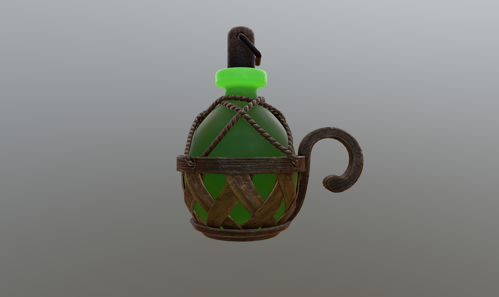
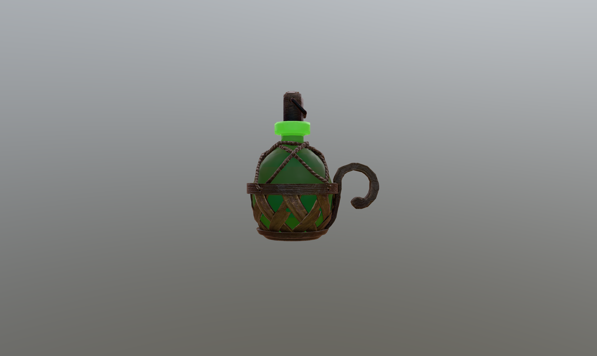
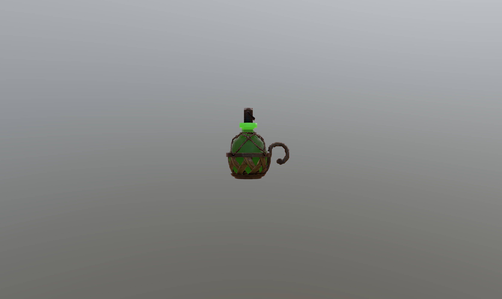
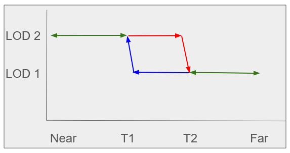

# Level of Detail

## Needs

There are many circumstances where a single model needs to have multiple levels of detail (LOD) when used in a scene. These include the reasons listed below. In an ideal situation devices, bandwidth, and servers would all be sufficiently powerful that no detail considerations would be required. LOD is a means to deal with real physical limitations of the user's environment.

* Bandwidth limitations prohibit the loading of large models
* Device limitations prohibit the loading of large or highly textured models
* The model is shown at a large virtual distance and device resources are not needed to correctly display the model
* The model is animated but device resources are not needed for an animated model

During the course of viewing a scene it may be necessary to change the LOD of a model. The reasons for this include:

* visual distance to certain model features
* model features may not be visible due to animation
* device capabilities may be insufficinet to display all features
* user is explicitly requesting a high quality version for rendering

## Investigation

Several organizations contributed to various pieces of potential solutions. It was agreed that there needed to be quantified (numeric) measures controlled by the content creator that determined when a particular model was used. Due to the variety of real-world limitations that the content create may need to handle, there was no agreement on a single specific measure.


### Asset Extent (min/max)

The asset property itself is extended by a min and max property, that is used similar to the min/max properties of position accessors. By providing min and max, an axis-aligned bounding box provides positioning information and reveals the extent of the asset. This information can be used to determine if the asset is currently in the viewport and to estimate the distance to the viewer. The extent of the asset can be used to estimate the size in relation to other assets.


### Byte Length

This property is the asset file size in bytes. Transmission speed and required memory is related to the asset file size. To balance visual quality as well as transmission speed and memory requirements each LOD has a byteLength property. With this property, the application can estimate the effort to acquire a certain quality promise. 

### Screen Coverage

Screen coverage, a percentage of the area of the screen that is filled with the asset's axis-aligned bounding box (given by min/max properties), is an intuitive way to hint the level that is required given a certain scene and camera setting. By only considering the asset's bounding box, calculating the current coverage can be performed with no significant overhead.

### Distance

The distance between the asset's bounding box and camera can be used as a very simple measure. It is useful when outlining a scene but does not consider screen resolution.

### Quality Pixels 

Quality pixels is an abstract definition of the number of pixels (in the projected diagonal) that can be expected to be rendered nicely with a given asset detail level. 
 

## Results

The prototype work on this capability used the JSON schema described below to produce the desired effects. There were no extra recommendations nor caveats. All of the changes solely apply to the glTFX file schema. There are no recommended changes or additions to the glTF file schema.

The following figures show the same scene with different camera views. If the asset has a high screen coverage, a high quality asset is used. For lower screen coverage, lower quality assets are used, respectively.

<div style="display: flex; justify-content: space-around; align-items: center;">
  <figure style="margin: 0 1px; text-align: center;">
    
    <figcaption>(a) High quality asset</figcaption>
  </figure>
  <figure style="margin: 0 1px; text-align: center;">
    
    <figcaption>(b) Medium quality asset</figcaption>
  </figure>
  <figure style="margin: 0 1px; text-align: center;">
    
    <figcaption>(c) Low quality asset</figcaption>
  </figure>
</div>
 


### File Schema

The asset property is extended as following: 

```
"assets": [
    {
        "uri": "default_asset.glb",
        "min": [x, y, z],
        "max": [x, y, z],
        "lod": [
            {
                "uri":  "high_quality.glb",
                "byteLength": 3000000,
                "qualityPixels": 300,
                "screenCoverage": 0.6,
                "distance": 1,
                "toleranceRange": 0.1
            },
            {
                "uri":  "medium_quality.glb",
                "byteLength": 2000000,
                "qualityPixels": 200,
                "screenCoverage": 0.3,
                "distance": 5,
                "toleranceRange": 0.1
            },
            {
                "uri":  "low_quality.glb",
                "byteLength": 1000000,
                "qualityPixels": 100,
                "screenCoverage": 0.1,
                "distance": 10,
                "toleranceRange": 0.1
            }
        ]
    }
],
```

Each asset property is extended by `min` and `max` properties that reveal the extent and position of the asset. Furthermore, each asset can be extended by an `lod` property that stores detail levels in an array. 
Each array object consists of an `uri` that points to an asset representing the detail level. The file size of the asset is given by the `byteLength` property. The properties `distance`, `screenCoverage` and `qualityPixels` are measures that can be used by the application to decide on the appropriate detail level. It was found that no single measure is sufficient for all cases to determine the displayed model. It is necessary for the same measure to be used for all levels of detail of a single model (glTF file). The property `toleranceRange` gives a hint regarding the deviation of a specific measure to avoid frequent changes of the detail level. This case is explained in detail in the following section.

### Transition Boundary

The measure for determining which model to use must not generate flashing or similar effects if the scene display is near the transition value. This either requires a "fuzz" factor that is applied uniformly to all transition values or a more complex data structure to explicitly list the transition ranges.

THe stability that is desired is illustrated in the graph below. The trapizodial region is stable as the LOD measure changes from "Near" to "Far" (or vice-versa). The displayed LOD level is not determined by solely the measure but depends on the direction of traversal.

**Illustration of LOD level vs. LOD Measure**



_The arrows indicate the direction of change of the measure (horizontal axis). Green double-headed arrows indicate determination based on the Measure. Single-headed arrows indicates the LOD when the Measure changes in the indicated direction. The LOD only transitions at T1 or T2. There is no transition except those points._

## References

*Medieval Flask* (https://skfb.ly/6RT9p) by Austin Crane (Euclid) is licensed under Creative Commons Attribution (http://creativecommons.org/licenses/by/4.0/).