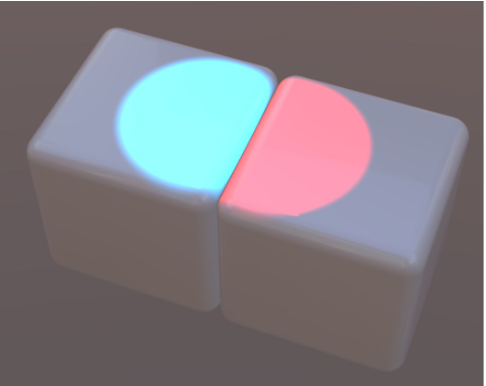
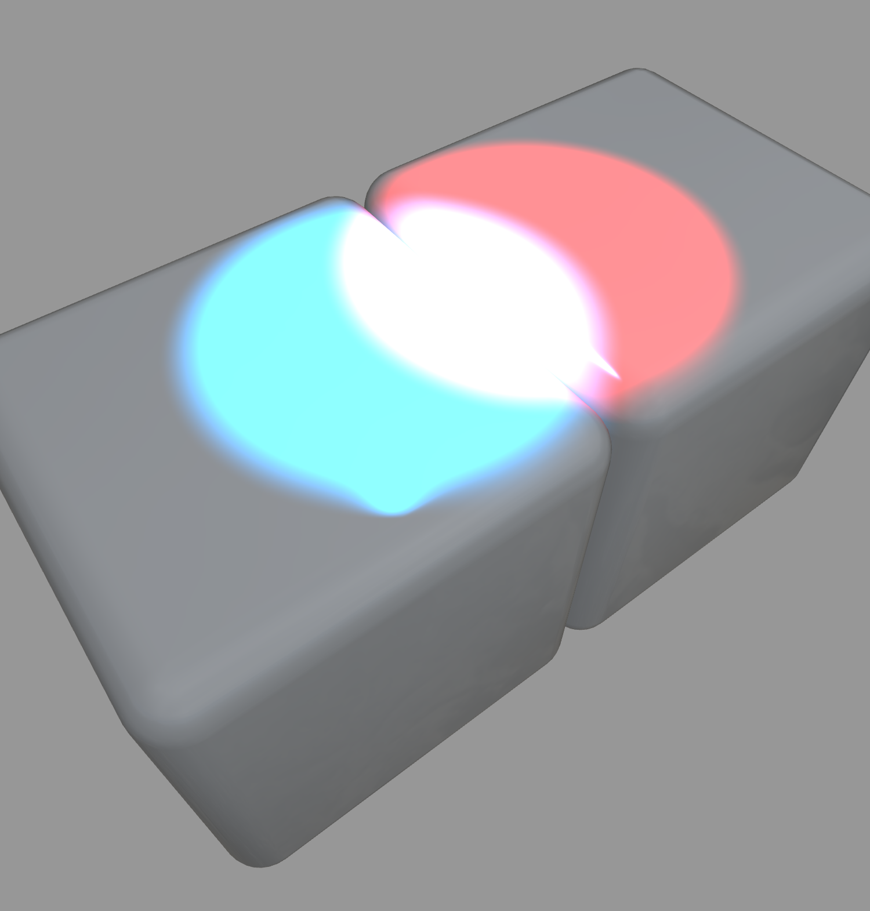
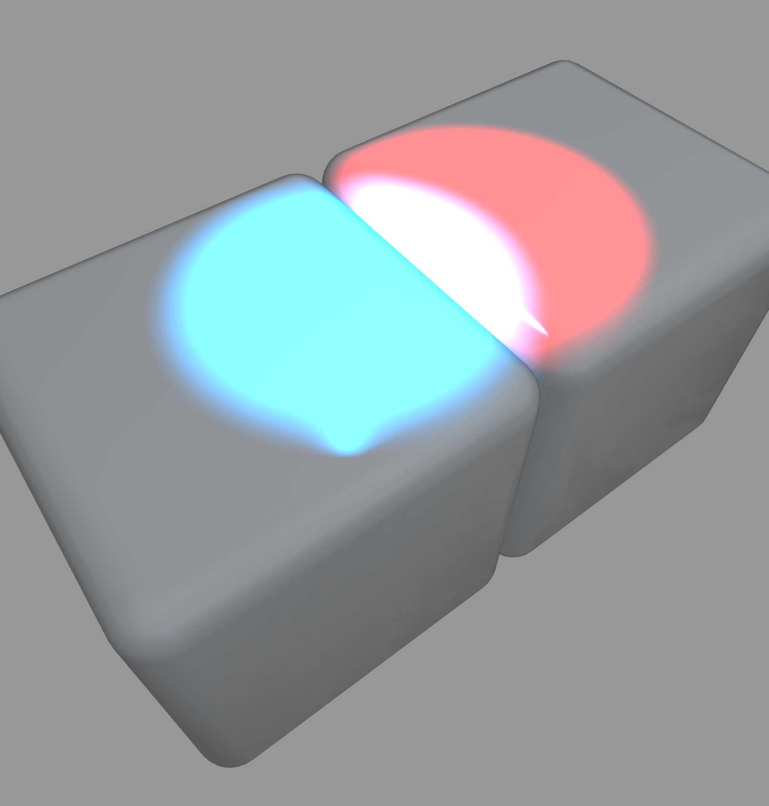

# Lighting

## Needs

Models can be lit with punctual lights and scene (environment) lighting. In either case the content creator needs to be able to control the extent to which light from one model affects other models in the scene. 

## Investigation

The investigative and prototyping work was performed using models from the DaoTown collection (need reference). This work was limited to control that could be managed within the glTFX file - no changes to glTF or glTF-only extensions. 

Two cases were considered - local-only and global lighting. The local-only lighting mode restricted lighting to the model where it was defined. This is what might be expected when a number of independent models are put into the same scene. (need to include screen shot)

In the real world light generally illuminates other near-by models. This situation was prototyped where the light from one model extend to other models according to the configuration of the light. This is what might be expected when a number of objects are put into the same glTF file. (need to include screen shot)

The situation is similar for environmental lighting. For example. this is necessary when the exterior of a model is in a different environment (say night) than the interior (substantial lighting). (need screen shots of these two cases)

## Results

The prototype work on this capability used the JSON schema described below to produce the desired effects. There were no extra recommendations nor caveats. All of the changes solely apply to the glTFX file schema. There are no recommended changes or additions to the glTF file schema.

### Example Schema

These example schema fragments are based on the larger glTF Reference schema described in other documents. These illustrate what is needed for this feature only.

#### Asset Lights

Insert lights that restrict punctual lights within a glTF file to only that asset

```
"assets": [
  {
    "uri": "box_blue.glb",
    "lightSource": "asset"
  },
  {
    "uri": "box_red.glb",
    "lightSource": "asset"
  }
]
```
Illustration of Asset-only lighting



The value "scene" is used instead of "asset" to indicate that the light scope is the entire scene. The image below illustrates that change in the above code. Note that the light from the two assets combine to produce a different color.

Illustration of Scene lighting


Mixing the lighting is allowed by setting the values for "lightSource" appropriately. This example sets the blue light to "scene" and the red light to "asset". Note that the overlap wi th the red light combines color.

Illustration of Mixed lighting



#### Environmental Lights

Environmental lighting is not specified in glTF files. This has long been felt to be the pervue of the Viewer and perhaps user control. glTFX files allow the definition of environental lighting. Similar considerations as for punctual lights apply here.

The schema fragment for this case is below where the field "environment" of "assets" is a pointer into the "environments" array.

```
"environments":[
  {
    "uri": "image_file.hdr"
  }
],
"assets": [
  {
    "uri": "box_blue.glb",
    "lightSource": "asset",
    "environment": 0
  },
  {
    "uri": "box_red.glb",
    "lightSource": "scene"
  }
],
```

## References

1.   (Khronos only)
1.  Images (c) 2024, Khronos; CC-BY. Produced by UX3D for Khronos.
