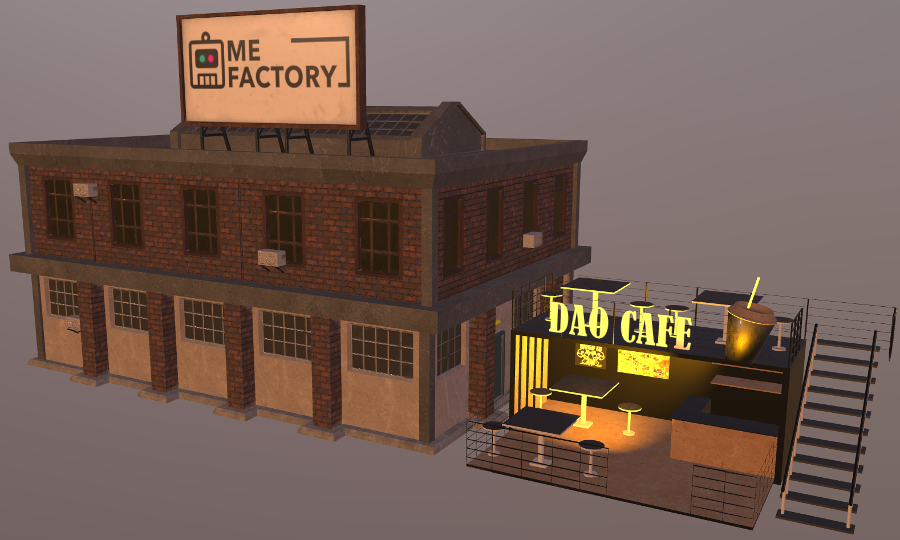

# Lighting

## Needs

Models can be lit with punctual lights and scene (environment) lighting. 
Assets might be designed in a way that illumination is self-contained. Punctual lights and environment ligthing may be tuned for the specific asset.  
When composing scenes, multiple individually designed lighting settings are combined. In some settings, one expects lighting of one asset to have an effect on other assets, in other settings one wants to avoid side effects. 

In either case the content creator needs to be able to control the extent to which light from one model affects other models in the scene. 

## Investigation

The investigative and prototyping work was performed using models from the DaoTown collection [1]. This work was limited to control that could be managed within the glTFX file - no changes to glTF or glTF-only extensions. 

Two cases were considered - local-only and scene-wide punctual lights. 
The local-only lighting mode restricts lighting to the asset where it was defined. This is what might be expected when a number of independent models are put into the same scene.



*Asset restricted illumination of punctual lights*

In the real world light generally illuminates other near-by models. This situation was prototyped where the light from one model extend to other models according to the configuration of the light. This is what might be expected when a number of objects are put into the same glTF file.


*Punctual lights illuminating whole scene*


The situation is similar for environmental lighting. For example. this is necessary when the exterior of a model is in a different environment (say bright sunlight) than the interior (dimmed lighting). (need screen shots of these two cases)


*Exterior is illuminated by a bright environment map*


*Interior is illuminated by a dimmed environment map*


## Results

The prototype work on this capability used the JSON schema described below to produce the desired effects. There were no extra recommendations nor caveats. All of the changes solely apply to the glTFX file schema. There are no recommended changes or additions to the glTF file schema.

### Example Schema

These example schema fragments are based on the larger glTF Reference schema described in other documents. These illustrate what is needed for this feature only.

#### Asset Lights

Insert lights that restrict punctual lights within a glTF file to only that asset

The glTFX file is extended by a property `lightSource` that specifies the source of considered punctual lights.

```
  "assets": 
  [
    {
      "uri": "box_blue.glb",
      "lightSource": "asset"
    },
    {
      "uri": "box_red.glb",
      "lightSource": "scene"
    }
  ]
```

Various lighting options are shown in the following figure that are controlled via the `lightSource` property.

<div style="display: flex; justify-content: space-around; align-items: center;">
  <figure style="margin: 0 1px; text-align: center;">
    
    <figcaption>(a) Asset-local illumination</figcaption>
  </figure>
  <figure style="margin: 0 1px; text-align: center;">
    
    <figcaption>(b) Scene illumination</figcaption>
  </figure>
  <figure style="margin: 0 1px; text-align: center;">
    
    <figcaption>(c) Mixed illumination</figcaption>
  </figure>
</div>
 


In example (a) all `lightSource` asset properties are set to `local`. In the image you can see the light sources attached to the asset not interacting with the respective other asset.


In example (b) all `lightSource` asset properties are set to `scene` to indicate that the light scope is the entire scene. Note that the light from the two assets combine to produce a different color.


Mixing the lighting in the scene is allowed by setting the values for `lightSource` per asset appropriately. Example (c) sets the left asset light source to `asset` and the right asset light source to `scene`. Note that the overlap with the red light combines color.


#### Environmental Lights

Environmental lighting is not specified in glTF files. This has long been felt to be the pervue of the viewer and perhaps user control. glTFX files allow the definition of environental lighting. Similar considerations as for punctual lights apply here.

The schema fragment below shows an example with two identical assets that are illuminated by two different environment maps. The file is extended by an `environments` array that lists uris pointing to hdr environment maps. Additionally, the brightness of the environment map can be scaled via an `intensity` factor. 

The asset is extended by an `environment` property that points to the respective index in the environments array. This asset has to be illuminated by referenced environment map. 

```
  "environments": 
  [ 
    {
      "uri": "dark.hdr", 
      "intensity": 0.4
    },
    {
      "uri": "bright.hdr", 
      "intensity": 3.5
    }
  ],
  "assets": 
  [
    {
      "uri": "sphere.glb",
      "environment": 0
    },
    {
      "uri": "sphere.glb",
      "environment": 1
    }
  ]
```

*The identical asset is rendered twice with different environment maps used for illumination*


## References

1. *DAOtown Building Kit* (https://skfb.ly/oO6Hp) by m3org is licensed under Creative Commons Attribution (http://creativecommons.org/licenses/by/4.0/).
1.   (Khronos only)
1.  Images (c) 2024, Khronos; CC-BY. Produced by UX3D for Khronos.
